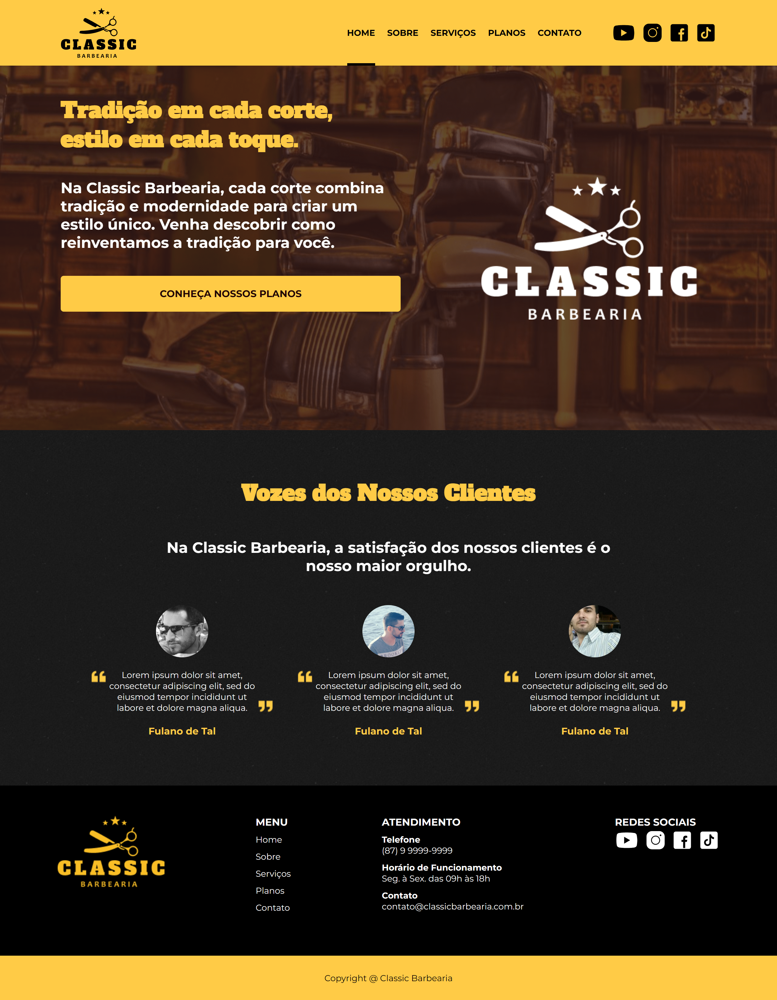

# Classic Barbearia

Este é o projeto da Classic Barbearia, um site fictício para uma barbearia que combina tradição e modernidade para criar um estilo único.

## Conteúdo

- [Descrição](#descrição)
- [Tecnologias Utilizadas](#tecnologias-utilizadas)
- [Screenshot](#screenshot)
- [Links](#links)

## Descrição

O projeto consiste em um site para a Classic Barbearia, uma barbearia fictícia que busca promover uma experiência única, combinando tradição e modernidade. O site inclui páginas como Home, Sobre, Serviços, Planos e Contato. Este projeto foi desenvolvido como parte da matéria de Programação para Internet I do curso de Análise e Desenvolvimento de Sistemas, no 3º Período do IFPE campus Garanhuns.

## Tecnologias Utilizadas

O projeto foi desenvolvido utilizando as seguintes tecnologias:

- HTML5
- CSS (incluindo Flexbox e CSS Grid)
- JavaScript

## Screenshot

## Links

- [Site ao vivo](#) [https://classic-barbearia.vercel.app/]

